# 🛒 Amazur: Amazon-like E-commerce Microservices Platform

[](https://www.docker.com/)
[](https://nodejs.org/)
[](https://angular.io/)
[](https://www.postgresql.org/)
[](https://python.org/)
[](https://php.net/)

> **A comprehensive microservices-based e-commerce platform built with modern technologies, featuring a polyglot architecture and containerized deployment.**

---

## 📋 Table of Contents

- [🎯 Project Overview](#-project-overview)
- [🏗️ Architecture](#️-architecture)
- [🚀 Quick Start](#-quick-start)
- [📚 API Documentation](#-api-documentation)
- [🔧 Services Details](#-services-details)
- [🖥️ Frontend](#️-frontend)
- [🔒 Security](#-security)
- [📊 Monitoring & Debugging](#-monitoring--debugging)
- [🤝 Contributing](#-contributing)
- [📄 License](#-license)

---

## 🎯 Project Overview

This project demonstrates a **production-ready microservices architecture** for an Amazon-like e-commerce platform. It showcases modern software engineering practices including containerization, API-first design, and polyglot programming.

### 🌟 Key Features

- ✅ **10 Independent Microservices** with clear domain separation
- ✅ **Polyglot Architecture** (Node.js, Python, PHP, TypeScript)
- ✅ **API Gateway Pattern** for centralized access control
- ✅ **Database per Service** pattern for data isolation
- ✅ **Full CRUD Operations** for all business entities
- ✅ **Secure Authentication** with JWT tokens and salt hashing
- ✅ **Admin Panel** with dedicated management interface
- ✅ **Transaction Tracking** with comprehensive audit trail
- ✅ **Docker Containerization** for consistent deployments

---

## 🏗️ Architecture

### System Overview

### Authentication Flow

```mermaid
graph TB
    U[👤 User] --> FE[🖥️ Angular Frontend<br/>Port: 4200]
    A[👨‍💼 Admin] --> FE
    
    FE --> GW[🚪 API Gateway<br/>Port: 5000]
    
    GW --> US[👥 User Service<br/>Port: 5001]
    GW --> PS[📦 Product Service<br/>Port: 5002]
    GW --> CS[🛒 Cart Service<br/>Port: 5005]
    GW --> PMS[💳 Payment Service<br/>Port: 5008]
    GW --> THS[📊 Transaction History<br/>Port: 5003]
    GW --> AS[🔐 Auth Service<br/>Port: 5004]
    GW --> TS[🎫 Token Service<br/>Port: 8101]
    GW --> VS[🏪 Vendor Service<br/>Port: 5006]
    GW --> VPS[📋 Vendor Product<br/>Port: 5009]
    GW --> ADS[⚙️ Admin Service<br/>Port: 5007]
    
    US --> USDB[(🐘 PostgreSQL<br/>Port: 3801)]
    PS --> PSDB[(🐘 PostgreSQL<br/>Port: 3802)]
    CS --> CSDB[(🐘 PostgreSQL<br/>Port: 3804)]
    PMS --> PMSDB[(🐘 PostgreSQL<br/>Port: 3807)]
    THS --> THSDB[(🐘 PostgreSQL<br/>Port: 3803)]
    VS --> VSDB[(🐘 PostgreSQL<br/>Port: 3806)]
    VPS --> VPSDB[(🐘 PostgreSQL<br/>Port: 3808)]
    ADS --> ADSDB[(🐘 PostgreSQL<br/>Port: 3805)]
    TS --> TSDB[(🐬 MySQL<br/>Port: 3306)]
    
    style FE fill:#e1f5fe
    style GW fill:#fff3e0
    style AS fill:#f3e5f5
    style TS fill:#f3e5f5
```



### 🛠️ Technology Stack

| Component | Technology | Purpose | Port |
|-----------|------------|---------|------|
| **API Gateway** | Node.js/Express | Request routing, Load balancing | 5000 |
| **Frontend** | Angular 15+ | User interface | 4200 |
| **User Service** | Node.js/JavaScript | User management | 5001 |
| **Product Service** | Node.js/JavaScript | Product catalog | 5002 |
| **Cart Service** | Node.js/TypeScript | Shopping cart logic | 5005 |
| **Payment Service** | Node.js/JavaScript | Payment processing | 5008 |
| **Transaction History** | Node.js/JavaScript | Audit trail | 5003 |
| **Auth Service** | Python | Authentication logic | 5004 |
| **Token Service** | PHP | JWT token management | 8101 |
| **Vendor Service** | Node.js/JavaScript | Vendor management | 5006 |
| **Vendor Product** | Node.js/JavaScript | Vendor-specific products | 5009 |
| **Admin Service** | Node.js/JavaScript | Admin operations | 5007 |

---

## 🚀 Quick Start

### Prerequisites

- 🐳 **Docker** (v20.10+)
- 🐙 **Docker Compose** (v2.0+)
- 🌐 **Git**

### Installation

1. **Clone the repository**
```bash
git clone https://github.com/XavierPelle/microservice-docker-nodejs.git
cd microservice-docker-nodejs/environnement
```

2. **Set up environment variables**
```bash
# Create .env files for each microservice
# Example for user-service:
echo "DB_HOST=db_user-service
DB_PORT=5432
DB_NAME=db_user-service
DB_USER=main
DB_PASS=FB1atQfXCPptY7I7BuMsAX91bGcTXx4R" > ../backend/user-service/.env
```

3. **Create Docker network**
```bash
docker network create microservice
```

4. **Launch the platform**
```bash
docker-compose up -d
```

5. **Initialize admin user**
```bash
cd ../backend/scripts
python create-admin.py
```

### 🎉 Access the Application

- **🖥️ Frontend:** http://localhost:4200
- **🚪 API Gateway:** http://localhost:5000
- **👨‍💼 Admin Panel:** http://localhost:4200/admin-login

---

## 📚 API Documentation

### 🚪 API Gateway Endpoints

**Base URL:** `http://localhost:5000`

#### 👥 User Management
```http
GET    /users              # Get all users
GET    /users/:id          # Get user by ID
POST   /users/create       # Create new user
PUT    /users/update/:id   # Update user
DELETE /users/delete/:id   # Delete user
```

#### 📦 Product Management
```http
GET    /product            # Get all products
GET    /product/:id        # Get product by ID
GET    /product/fakedata   # Generate fake products for testing
POST   /product/create     # Create new product
PUT    /product/update/:id # Update product
DELETE /product/delete/:id # Delete product
```

#### 🛒 Cart Management
```http
GET    /cart               # Get all carts
GET    /cart/find/:id      # Find cart by ID
POST   /cart/create        # Create new cart
PUT    /cart/update/:id    # Update cart
DELETE /cart/delete/:id    # Delete cart
```

#### 💳 Payment Processing
```http
POST   /payement           # Process payment
GET    /payement/user/:user_id # Get user payment history
```

#### 📊 Transaction History
```http
GET    /transaction-history         # Get all transaction history
GET    /transaction-history/:id     # Get specific transaction
GET    /transaction-history/user/:userId # Get user transaction history
POST   /transaction-history/create  # Create transaction entry
```

#### 🔐 Authentication
```http
POST   /register           # Register new user
POST   /register_up        # Complete registration
POST   /login              # User login
POST   /login_send         # Send login data
POST   /admin/login        # Admin login
POST   /verify-token       # Verify JWT token
```

#### 🏪 Vendor Management
```http
# Vendor Operations (Admin/Vendor access)
GET    /vendors                     # Get all vendors (Admin only)
GET    /vendors/:id                 # Get vendor by ID
GET    /vendors/user/:userId        # Get vendor by user ID
POST   /vendors                     # Create new vendor
PUT    /vendors/:id                 # Update vendor (Vendor/Admin)
DELETE /vendors/:id                 # Delete vendor (Admin only)

# Vendor Product Management
GET    /vendors/:vendorId/get/products        # Get vendor products
GET    /vendors/product/:id                   # Get specific vendor product
GET    /vendors/products                      # Get all vendor products (public)
POST   /vendors/:vendorId/products            # Add product to vendor
PUT    /vendors/:vendorId/products/:productId # Update vendor product
DELETE /vendors/:vendorId/products/:productId # Delete vendor product

# Vendor Dashboard
GET    /vendors/:vendorId/dashboard           # Vendor dashboard (Vendor/Admin)
```

#### 🔑 Vendor Authentication
```http
POST   /auth/register          # Vendor registration
POST   /auth/register-complete # Complete vendor registration
POST   /auth/login-send        # Send vendor login data
POST   /auth/login             # Vendor login
POST   /auth/verify-token      # Verify vendor token
```

#### ⚙️ Admin Panel
```http
# Admin Management
GET    /admin/admins           # Get all admins
GET    /admin/admins/:id       # Get admin by ID
GET    /admin/admins/user/:userId # Get admin by user ID
POST   /admin/admins           # Create new admin
PUT    /admin/admins/:id       # Update admin
DELETE /admin/admins/:id       # Delete admin

# User Management (Admin)
GET    /admin/users            # Get all users
POST   /admin/users            # Create new user
PUT    /admin/users/:id        # Update user
DELETE /admin/users/:id        # Delete user

# Vendor Management (Admin)
GET    /admin/vendors          # Get all vendors
POST   /admin/vendors          # Create new vendor
PUT    /admin/vendors/:id      # Update vendor
DELETE /admin/vendors/:id      # Delete vendor

# Product Management (Admin)
GET    /admin/products         # Get all products
POST   /admin/products         # Create new product
PUT    /admin/products/:id     # Update product
DELETE /admin/products/:id     # Delete product

# Dashboard & Analytics
GET    /admin/dashboard/stats  # Get dashboard statistics
```

### Role-Based Access Control

The API implements comprehensive role-based access control (RBAC):

**Roles:**
- **Admin:** Full system access and management capabilities
- **Vendor:** Manage own products and access vendor-specific features
- **User:** Standard customer access to shopping features

**Access Control Examples:**
```javascript
// Admin-only access
GET /vendors                    // Requires admin role
DELETE /vendors/:id            // Requires admin role
GET /admin/dashboard/stats     // Requires admin role

// Vendor or Admin access
PUT /vendors/:id               // Requires vendor or admin role
POST /vendors/:vendorId/products // Requires vendor or admin role

// Public access
GET /vendors/products          // No authentication required
GET /product                   // No authentication required
```


### 📝 Request/Response Examples

#### Create User
```bash
curl -X POST http://localhost:5000/users/create \
  -H "Content-Type: application/json" \
  -d '{
    "firstName": "John",
    "lastName": "Doe",
    "email": "john.doe@example.com",
    "password": "securePassword123"
  }'
```

#### Get Products
```bash
curl -X GET http://localhost:5000/product \
  -H "Authorization: Bearer YOUR_JWT_TOKEN"
```

---

## 🔧 Services Details

### 🎯 Core Business Services

<details>
<summary><strong>👥 User Service</strong></summary>

**Technology:** Node.js/JavaScript  
**Database:** PostgreSQL  
**Responsibilities:**
- User profile management
- User data persistence
- Account information CRUD operations

**Key Features:**
- Secure password storage with unique salt
- Email validation
- User profile updates
- Account deletion with data cleanup
</details>

<details>
<summary><strong>📦 Product Service</strong></summary>

**Technology:** Node.js/JavaScript  
**Database:** PostgreSQL  
**Responsibilities:**
- Product catalog management
- Inventory tracking
- Product search and filtering

**Key Features:**
- Rich product metadata (name, description, price, stock)
- Category and tag management
- Image URL storage
- Stock level monitoring
</details>

<details>
<summary><strong>🛒 Cart Service</strong></summary>

**Technology:** Node.js/TypeScript  
**Database:** PostgreSQL  
**Responsibilities:**
- Shopping cart state management
- Cart persistence across sessions
- Cart calculation logic

**Key Features:**
- Type-safe cart operations
- Real-time price calculation
- Cart abandonment tracking
- Multi-item cart management
</details>

### 🔒 Security Services

<details>
<summary><strong>🔐 Auth Service</strong></summary>

**Technology:** Python  
**Database:** None (stateless)  
**Responsibilities:**
- Authentication logic
- Password hashing and verification
- Security policy enforcement

**Key Features:**
- bcrypt password hashing with unique salts
- Rate limiting protection
- Secure authentication workflows
- Integration with User Service for data
</details>

<details>
<summary><strong>🎫 Token Service</strong></summary>

**Technology:** PHP  
**Database:** MySQL  
**Responsibilities:**
- JWT token generation and validation
- Token lifecycle management
- Session management

**Key Features:**
- JWT token generation with custom claims
- Token expiration handling
- Refresh token mechanism
- Token blacklisting for logout
</details>

### 💼 Business Services

<details>
<summary><strong>💳 Payment Service</strong></summary>

**Technology:** Node.js/JavaScript  
**Database:** PostgreSQL  
**Responsibilities:**
- Payment processing
- Transaction recording
- Payment method management

**Key Features:**
- Multiple payment gateway support
- Transaction status tracking
- Payment history
- Refund processing
</details>

<details>
<summary><strong>📊 Transaction History Service</strong></summary>

**Technology:** Node.js/JavaScript  
**Database:** PostgreSQL  
**Responsibilities:**
- Transaction audit trail
- Business analytics data
- Compliance reporting

**Key Features:**
- Automatic transaction logging
- Purchase/Sale/Exchange tracking
- Analytics data aggregation
- Compliance audit trails
</details>

---

## 🖥️ Frontend

### Angular Application

**Technology Stack:**
- **Framework:** Angular 15+
- **Styling:** Angular Material + Custom CSS
- **State Management:** RxJS + Services
- **HTTP Client:** Angular HttpClient with interceptors

### Key Features

- **Authentication System**
  - User login/registration
  - JWT token management
  - Protected routes and guards

- **E-commerce Functionality**
  - Product browsing and search
  - Shopping cart management
  - Checkout process
  - Order history

- **Admin Panel**
  - User management dashboard
  - Product inventory management
  - Transaction monitoring
  - System analytics

- **Vendor Portal**
  - Vendor registration and authentication
  - Product management for vendors
  - Vendor-specific dashboard
  - Sales analytics

### Request Builder Service

The frontend implements a centralized HTTP service for secure API communication:

**Key Features:**
- **Automatic Token Management:** Attaches JWT tokens to all authenticated requests
- **Token Validation:** Verifies token validity before making requests
- **Automatic Redirects:** Redirects to login page when authentication fails
- **Flexible Request Builder:** Supports GET, POST, PUT, DELETE operations
- **Connection Bypass:** Option to skip authentication for public endpoints

**Implementation Example:**
```typescript
// Authenticated request
this.requestBuilder.execute('get', '/users/profile').subscribe(
  response => console.log('User profile:', response),
  error => console.error('Request failed:', error)
);

// Public request (skip authentication)
this.requestBuilder.execute('get', '/product', null, true).subscribe(
  response => console.log('Public products:', response)
);
```

**Security Features:**
- JWT token verification before each request
- Automatic session management
- Error handling with user-friendly redirects
- Base URL configuration through environment variables

### Admin Access

**Default Admin Credentials:**
- **URL:** http://localhost:4200/admin-login
- **Email:** `admin@example.com`
- **Password:** `admin123`

**Admin Features:**
- Dashboard with key metrics
- User management (CRUD operations)
- Product management (inventory, pricing)
- Vendor management and oversight
- Transaction monitoring and reporting
- System configuration

---

## 🔒 Security

### 🛡️ Security Features

- **🔐 Multi-layer Authentication**
  - JWT tokens with expiration
  - bcrypt password hashing with unique salts
  - Secure session management

- **🗃️ Data Protection**
  - Database per service isolation
  - Environment variable configuration
  - No hardcoded credentials in code

- **🌐 Network Security**
  - Docker network isolation
  - API Gateway as single entry point
  - CORS configuration

### 🔧 Security Configuration

**Environment Variables (per service):**
```bash
# Example .env file
DB_HOST=localhost
DB_PORT=5432
DB_NAME=service_db
DB_USER=service_user
DB_PASS=secure_random_password
JWT_SECRET=your_jwt_secret_key
SALT_ROUNDS=12
```

**Recommended Security Enhancements:**
- 🔒 HTTPS/TLS encryption
- 🚦 Rate limiting and DDoS protection
- 🔍 Input validation and sanitization
- 📊 Security audit logging
- 🔐 Two-factor authentication (2FA)

---

## 📊 Monitoring & Debugging

### 🔍 Container Monitoring

**View service logs:**
```bash
# View logs for specific service
docker logs user-service
docker logs product-service
docker logs api-gateway

# Follow logs in real-time
docker logs -f cart-service

# View last 100 lines
docker logs --tail 100 payment-service
```

**Access container shell:**
```bash
# Access container for debugging
docker exec -it user-service /bin/sh
docker exec -it product-service /bin/bash

# Run commands inside container
docker exec user-service npm test
```

### 📈 Health Checks

**Service availability:**
```bash
# Check all running containers
docker-compose ps

# Check specific service health
curl http://localhost:5001/health  # User service
curl http://localhost:5002/health  # Product service
```

### Common Troubleshooting

<details>
<summary><strong>Database Connection Issues</strong></summary>

```bash
# Check database container status
docker logs db_user-service

# Verify database connectivity
docker exec -it db_user-service psql -U main -d db_user-service

# Reset database container
docker-compose down
docker-compose up -d db_user-service
```
</details>

<details>
<summary><strong>Network Issues</strong></summary>

```bash
# Recreate Docker network
docker network rm microservice
docker network create microservice

# Check network connectivity
docker network inspect microservice

# Test inter-service communication
docker exec api-gateway ping user-service
```
</details>

---

## 🏗️ Development

### 🔧 Local Development Setup

**Prerequisites for development:**
```bash
# Install Node.js dependencies
cd backend/api-gateway && npm install
cd ../user-service && npm install
# ... repeat for each service

# Install Python dependencies
cd ../auth-service && pip install -r requirements.txt

# Install PHP dependencies  
cd ../token-service && composer install
```

**Development workflow:**
```bash
# Start individual services for development
docker-compose up -d db_user-service
cd backend/user-service && npm run dev

# Run tests
npm test                    # JavaScript/TypeScript services
python -m pytest          # Python services
./vendor/bin/phpunit       # PHP services
```

### 📁 Project Structure

```
microservice-docker-nodejs/
├── backend/
│   ├── api-gateway/                # Main entry point
│   ├── user-service/               # User management
│   ├── product-service/            # Product catalog
│   ├── cart-service/               # Shopping cart (TypeScript)
│   ├── payment-service/            # Payment processing
│   ├── transaction-history-service/ # Audit trail
│   ├── auth-service/               # Authentication (Python)
│   ├── token-service/              # JWT management (PHP)
│   ├── vendor-service/             # Vendor management
│   ├── vendor-product-service/     # Vendor products
│   ├── admin-service/              # Admin operations
│   └── scripts/                    # Utility scripts
├── frontend/                       # Angular application
├── environnement/                  # Docker configuration
│   └── docker-compose.yml          # Service orchestration
└── README.md                       # This file
```

---

## 🤝 Contributing

We welcome contributions! Please follow these steps:

1. **🍴 Fork the repository**
2. **🌿 Create a feature branch** (`git checkout -b feature/amazing-feature`)
3. **💾 Commit your changes** (`git commit -m 'Add amazing feature'`)
4. **📤 Push to the branch** (`git push origin feature/amazing-feature`)
5. **🔄 Open a Pull Request**

### Development Guidelines

- Follow existing code style and conventions
- Add unit tests for new features
- Update documentation as needed
- Ensure all services start successfully
- Test API endpoints thoroughly

---

## 📄 License

This project is licensed under the MIT License - see the [LICENSE](LICENSE) file for details.

---

## 🙏 Acknowledgments

- **Docker Community** for containerization best practices
- **Node.js Ecosystem** for robust microservices frameworks
- **Angular Team** for the powerful frontend framework
- **PostgreSQL Community** for reliable database solutions

---

## 📞 Support

If you encounter any issues or have questions:

1. **📚 Check the documentation** above
2. **🐛 Search existing issues** on GitHub
3. **💬 Create a new issue** with detailed information
4. **📧 Contact the maintainers** for urgent matters

---
